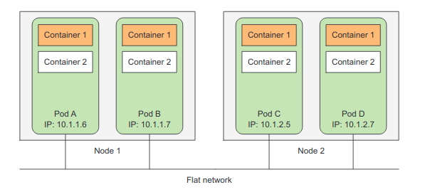
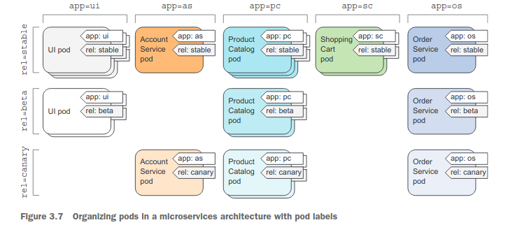

# Kubernetes Pod Q&A

---

## Pod란 무엇인가요?

---

컨테이너 - 프로세스가 하위 프로세스를 생성하지 않는 한 컨테이너 당 하나의 프로세스만 실행토록 설계

관련 없는 여러 프로세스를 관리하는 방법이 필요(로그, 재시작 매커니즘 등)

컨테이너를 여러 개 만들어서 각각 프로세스를 띄우도록 만듦.

이런 상황에서 컨테이너 집합을 다루는 Pod 개념이 등장.

---

## Pod안에 컨테이너는 완전히 격리되어 있는 상태인가요?

---

댓츠 노노 그렇지 않다.
동일한 네트워크, UTS 네임스페이스를 사용하기에 같은 호스트 네임과 네트워크 인터페이스를 공유한다.

---

## Pod와 Pod 사이에 포트 공간은 공유되나요?

## Pod안에 컨테이너 사이에 포트 공간은 공유되나요?

---

댓츠 노노 그렇지않다. 독립적이다.

그렇다. 공유되기에 조심해야한다.

---

## 포드 간의 통신은 어떻게 이뤄지나요?

---

LAN처럼 ip로 직접 통신할 수 있다.
no NAT 게이트웨이.
어떤 워커 노드에 있던지 상관없이 flat network 상에서 통신한다.

---

## 라벨과 활용

---

쿠버네티스 오브젝트를 조직화시킬 수 있는 방법.

라벨로 키/벨류 쌍을 할당하고
라벨 셀렉터로 객체와 라벨을 바인딩할 수 있다.

---

---

---

# Tip

---

## kubectl explain pod

## kubectl explain pod.spec

---
